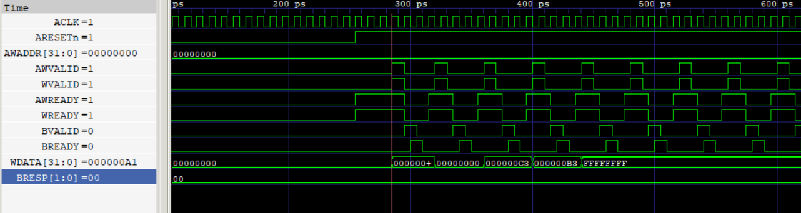
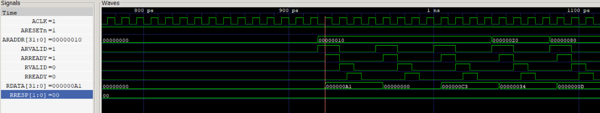

# AXI-Lite Protocol with FIFO Wrapper

This project simulates an AXI-Lite interface wrapped around a FIFO buffer using Verilator. It includes a cycle-accurate testbench, protocol coverage tracking, and waveform visibility for debugging and verification.

## 🔧 Features

- AXI-Lite compliant read/write interface
- FIFO buffer with overflow/underflow protection
- Verilator-based simulation harness
- Coverage tracker for protocol events
- UVM-style driver, monitor, and sequence modules
- Waveform generation via VCD

## 📁 Directory Structure

```
rtl/        # Verilog RTL files (dut.v, fifo.sv, wrapper.sv)  
sim/        # C++ testbench files (driver, monitor, coverage_tracker, etc.)  
include/    # Header files for simulation components  
obj_dir/    # Verilator-generated build artifacts
```

## 🚀 Build & Run

```bash
make clean
make VERBOSE=1
./run_sim
```
Requires Verilator and a C++17-compatible compiler.

## 📊 Waveform Viewing

After simulation, open `dump.vcd` in GTKWave:

```bash
gtkwave dump.vcd
```
## 📷 Waveform Snapshots
✅ Write Transaction
This snapshot shows a valid AXI-Lite write transaction. AWVALID/AWREADY and WVALID/WREADY handshakes are asserted, and WDATA is transferred correctly.




✅ Read Transaction
This snapshot shows a valid AXI-Lite read transaction. ARVALID/ARREADY and RVALID/RREADY handshakes are asserted, and RDATA is returned correctly.




## 🔄 AXI-Lite Handshake Visibility
This simulation tracks all key AXI-Lite handshakes:

Write Address Channel: AWVALID & AWREADY

Write Data Channel: WVALID & WREADY

Write Response Channel: BVALID & BREADY

Read Address Channel: ARVALID & ARREADY

Read Data Channel: RVALID & RREADY

All handshakes are timestamped and logged by the monitor module. Signal transitions are aligned to clock edges for cycle-accurate debugging. This ensures every transaction completes correctly and the FIFO wrapper responds as expected.
## 🧪 Simulation Output

```text
[INFO] Applying reset...
[INFO] Reset released.
[INFO] Running FIFO sequence...
Pushing 16 values into FIFO...
[WRITE] Addr: 0x0, Data: 0xa1
[MONITOR @ 295ns] WriteResp: addr=0x0, data=0xa1, BRESP=0
...
[WRITE] Addr: 0x0, Data: 0xfffffcff
[MONITOR @ 895ns] WriteResp: addr=0x0, data=0xfffffcff, BRESP=0

Popping 3 values from FIFO...
[READ] Addr: 0x10
[MONITOR @ 935ns] ReadResp: addr=0x10, data=0xa1, RRESP=0
...
[READ] Addr: 0x80
[MONITOR @ 1095ns] ReadResp: addr=0x80, data=0xd, RRESP=0

[INFO] Sampling post-sequence responses...

=== AXI-Lite Write Log ===
  addr=0x0, data=0xa1, BRESP=0
  ...
  addr=0x0, data=0xfffffcff, BRESP=0

=== AXI-Lite Read Log ===
  addr=0x10, data=0xa1, RRESP=0
  ...
  addr=0x80, data=0xd, RRESP=0

=== Coverage Report ===
Reads: 5, Writes: 16
Address bins:
  Low (<0x10): 16
  Mid (<0x80): 4
  High (>=0x80): 1
Data bins:
  Zero (0x00000000): 2
  Ones (0xFFFFFFFF): 8
  Alternating (0xAA/0x55): 3
FIFO depth bins:
  Empty: 0
  Half-full: 13
  Full: 1
Error bins:
  Invalid address: 0
  Corrupt data   : 0
```
This output is generated using a UVM-style testbench with modular driver, monitor, and coverage tracker components. All protocol events are timestamped and aligned to clock edges for cycle-accurate analysis.


## ✅ Protocol Coverage Summary

- **Total Writes**: 16  
- **Total Reads**: 5  
- **BRESP/RRESP**: All OKAY (0)  
- **FIFO Status**: No overflow or underflow  
- **Address bins**: 0x0 (write), 0x10 / 0x20 / 0x80 (read)  
- **Data patterns**: Sequential, Zero, Ones, Alternating  
- **Errors**: None

## 📌 Author

**Meenal Gada**  
Transitioning from AC Power Application Engineering to ASIC Verification  
GitHub: [meenalgada142](https://github.com/meenalgada142)

